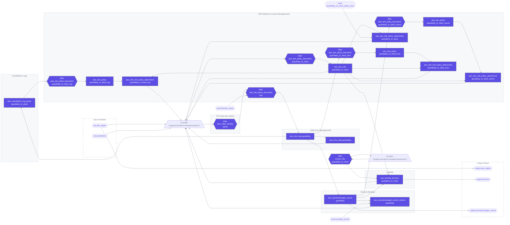
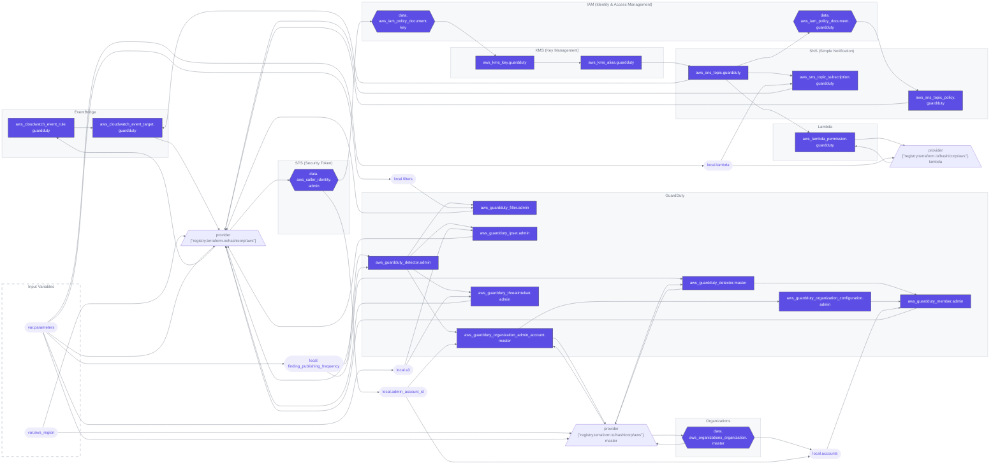
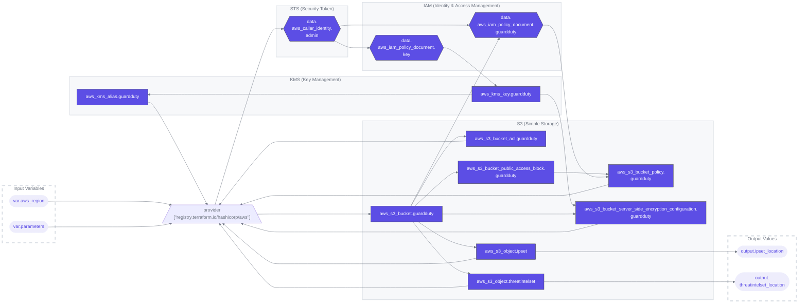

# terraform-aws-guardduty-organization

## lambda

```mermaid
%%tfmermaid:lambda
%%{init:{"theme":"default","themeVariables":{"lineColor":"#6f7682","textColor":"#6f7682"}}}%%
flowchart LR
classDef r fill:#5c4ee5,stroke:#444,color:#fff
classDef v fill:#eeedfc,stroke:#eeedfc,color:#5c4ee5
classDef ms fill:none,stroke:#dce0e6,stroke-width:2px
classDef vs fill:none,stroke:#dce0e6,stroke-width:4px,stroke-dasharray:10
classDef ps fill:none,stroke:none
classDef cs fill:#f7f8fa,stroke:#dce0e6,stroke-width:2px
subgraph "n0"["CloudWatch Logs"]
n1["aws_cloudwatch_log_group.<br/>guardduty_to_slack"]:::r
end
class n0 cs
subgraph "n2"["IAM (Identity & Access Management)"]
n3["aws_iam_policy.<br/>guardduty_to_slack_kms"]:::r
n4["aws_iam_policy.<br/>guardduty_to_slack_log"]:::r
n5["aws_iam_policy.<br/>guardduty_to_slack_secret"]:::r
n6["aws_iam_role.<br/>guardduty_to_slack"]:::r
n7["aws_iam_role_policy_attachment.<br/>guardduty_to_slack"]:::r
n8["aws_iam_role_policy_attachment.<br/>guardduty_to_slack_kms"]:::r
n9["aws_iam_role_policy_attachment.<br/>guardduty_to_slack_log"]:::r
na["aws_iam_role_policy_attachment.<br/>guardduty_to_slack_secret"]:::r
nb{{"data.<br/>aws_iam_policy_document.<br/>guardduty_to_slack"}}:::r
nc{{"data.<br/>aws_iam_policy_document.<br/>guardduty_to_slack_kms"}}:::r
nd{{"data.<br/>aws_iam_policy_document.<br/>guardduty_to_slack_log"}}:::r
ne{{"data.<br/>aws_iam_policy_document.<br/>guardduty_to_slack_secret"}}:::r
nf{{"data.<br/>aws_iam_policy_document.<br/>key"}}:::r
end
class n2 cs
subgraph "ng"["KMS (Key Management)"]
nh["aws_kms_alias.guardduty"]:::r
ni["aws_kms_key.guardduty"]:::r
end
class ng cs
subgraph "nj"["Lambda"]
nk["aws_lambda_function.<br/>guardduty_to_slack"]:::r
end
class nj cs
subgraph "nl"["Secrets Manager"]
nm["aws_secretsmanager_secret.<br/>guardduty"]:::r
nn["aws_secretsmanager_secret_version.<br/>guardduty"]:::r
end
class nl cs
no{{"data.<br/>archive_file.<br/>guardduty_to_slack"}}:::r
subgraph "np"["STS (Security Token)"]
nq{{"data.<br/>aws_caller_identity.<br/>admin"}}:::r
end
class np cs
subgraph "nr"["Output Values"]
ns(["output.aws_region"]):::v
nt(["output.function"]):::v
nu(["output.secretsmanager_secret"]):::v
end
class nr vs
nv[/"provider<br/>[&quot;registry.terraform.io/hashicorp/archive&quot;]"\]
nw[/"provider<br/>[&quot;registry.terraform.io/hashicorp/aws&quot;]"\]
subgraph "nx"["Input Variables"]
ny(["var.aws_region"]):::v
nz(["var.parameters"]):::v
end
class nx vs
n10(["local.<br/>guardduty_to_slack_policy_arns"]):::v
n11(["local.example_secret"]):::v
n12(["local.function_name"]):::v
ni-->n1
nc-->n3
nd-->n4
ne-->n5
nb-->n6
n6-->n7
n10-->n7
n3-->n8
n6-->n8
n4-->n9
n6-->n9
n5-->na
n6-->na
ni-->nh
nf-->ni
n6-->nk
nm-->nk
no-->nk
ni-->nm
nm-->nn
n11-->nn
nv-->no
nw-->nq
nw-->nb
ni-->nc
n1-->nd
nm-->ne
nq-->nf
n12-->nf
ny--->ns
nk--->nt
nm--->nu
no-->nv
n7-->nw
n8-->nw
n9-->nw
na-->nw
nh-->nw
nk-->nw
nn-->nw
ny--->nw
nz--->nw
```

## region

```mermaid
%%tfmermaid:region
%%{init:{"theme":"default","themeVariables":{"lineColor":"#6f7682","textColor":"#6f7682"}}}%%
flowchart LR
classDef r fill:#5c4ee5,stroke:#444,color:#fff
classDef v fill:#eeedfc,stroke:#eeedfc,color:#5c4ee5
classDef ms fill:none,stroke:#dce0e6,stroke-width:2px
classDef vs fill:none,stroke:#dce0e6,stroke-width:4px,stroke-dasharray:10
classDef ps fill:none,stroke:none
classDef cs fill:#f7f8fa,stroke:#dce0e6,stroke-width:2px
subgraph "n0"["EventBridge"]
n1["aws_cloudwatch_event_rule.<br/>guardduty"]:::r
n2["aws_cloudwatch_event_target.<br/>guardduty"]:::r
end
class n0 cs
subgraph "n3"["GuardDuty"]
n4["aws_guardduty_detector.admin"]:::r
n5["aws_guardduty_detector.master"]:::r
n6["aws_guardduty_filter.admin"]:::r
n7["aws_guardduty_ipset.admin"]:::r
n8["aws_guardduty_member.admin"]:::r
n9["aws_guardduty_organization_admin_account.<br/>master"]:::r
na["aws_guardduty_organization_configuration.<br/>admin"]:::r
nb["aws_guardduty_threatintelset.<br/>admin"]:::r
end
class n3 cs
subgraph "nc"["KMS (Key Management)"]
nd["aws_kms_alias.guardduty"]:::r
ne["aws_kms_key.guardduty"]:::r
end
class nc cs
subgraph "nf"["Lambda"]
ng["aws_lambda_permission.<br/>guardduty"]:::r
end
class nf cs
subgraph "nh"["SNS (Simple Notification)"]
ni["aws_sns_topic.guardduty"]:::r
nj["aws_sns_topic_policy.<br/>guardduty"]:::r
nk["aws_sns_topic_subscription.<br/>guardduty"]:::r
end
class nh cs
subgraph "nl"["STS (Security Token)"]
nm{{"data.<br/>aws_caller_identity.<br/>admin"}}:::r
end
class nl cs
subgraph "nn"["IAM (Identity & Access Management)"]
no{{"data.<br/>aws_iam_policy_document.<br/>guardduty"}}:::r
np{{"data.<br/>aws_iam_policy_document.<br/>key"}}:::r
end
class nn cs
subgraph "nq"["Organizations"]
nr{{"data.<br/>aws_organizations_organization.<br/>master"}}:::r
end
class nq cs
ns[/"provider<br/>[&quot;registry.terraform.io/hashicorp/aws&quot;]"\]
nt[/"provider<br/>[&quot;registry.terraform.io/hashicorp/aws&quot;].<br/>lambda"\]
nu[/"provider<br/>[&quot;registry.terraform.io/hashicorp/aws&quot;].<br/>master"\]
subgraph "nv"["Input Variables"]
nw(["var.aws_region"]):::v
nx(["var.parameters"]):::v
end
class nv vs
ny(["local.<br/>finding_publishing_frequency"]):::v
nz(["local.filters"]):::v
n10(["local.s3"]):::v
n11(["local.accounts"]):::v
n12(["local.admin_account_id"]):::v
n13(["local.lambda"]):::v
ns-->n1
n1-->n2
ni-->n2
ny-->n4
ns-->n4
ny-->n5
nu-->n5
n4-->n6
nz-->n6
n4-->n7
n10-->n7
n5-->n8
na-->n8
n11-->n8
n4-->n9
n12-->n9
nu-->n9
n9-->na
n4-->nb
n10-->nb
ne-->nd
np-->ne
ni-->ng
nt-->ng
nd-->ni
no-->nj
ni-->nk
n13-->nk
ns-->nm
ni-->no
nm-->np
nu-->nr
nr-->n11
n12-->n11
nm-->n12
nx--->nz
nx--->ny
nx--->n13
nx--->n10
n2-->ns
n6-->ns
n7-->ns
n8-->ns
nb-->ns
nj-->ns
nk-->ns
nw--->ns
nx--->ns
ng-->nt
n13-->nt
n5-->nu
n9-->nu
nr-->nu
nw--->nu
nx--->nu
```

## s3

```mermaid
%%tfmermaid:s3
%%{init:{"theme":"default","themeVariables":{"lineColor":"#6f7682","textColor":"#6f7682"}}}%%
flowchart LR
classDef r fill:#5c4ee5,stroke:#444,color:#fff
classDef v fill:#eeedfc,stroke:#eeedfc,color:#5c4ee5
classDef ms fill:none,stroke:#dce0e6,stroke-width:2px
classDef vs fill:none,stroke:#dce0e6,stroke-width:4px,stroke-dasharray:10
classDef ps fill:none,stroke:none
classDef cs fill:#f7f8fa,stroke:#dce0e6,stroke-width:2px
subgraph "n0"["KMS (Key Management)"]
n1["aws_kms_alias.guardduty"]:::r
n2["aws_kms_key.guardduty"]:::r
end
class n0 cs
subgraph "n3"["S3 (Simple Storage)"]
n4["aws_s3_bucket.guardduty"]:::r
n5["aws_s3_bucket_acl.guardduty"]:::r
n6["aws_s3_bucket_policy.<br/>guardduty"]:::r
n7["aws_s3_bucket_public_access_block.<br/>guardduty"]:::r
n8["aws_s3_bucket_server_side_encryption_configuration.<br/>guardduty"]:::r
n9["aws_s3_object.ipset"]:::r
na["aws_s3_object.threatintelset"]:::r
end
class n3 cs
subgraph "nb"["STS (Security Token)"]
nc{{"data.<br/>aws_caller_identity.<br/>admin"}}:::r
end
class nb cs
subgraph "nd"["IAM (Identity & Access Management)"]
ne{{"data.<br/>aws_iam_policy_document.<br/>guardduty"}}:::r
nf{{"data.<br/>aws_iam_policy_document.<br/>key"}}:::r
end
class nd cs
subgraph "ng"["Output Values"]
nh(["output.ipset_location"]):::v
ni(["output.<br/>threatintelset_location"]):::v
end
class ng vs
nj[/"provider<br/>[&quot;registry.terraform.io/hashicorp/aws&quot;]"\]
subgraph "nk"["Input Variables"]
nl(["var.aws_region"]):::v
nm(["var.parameters"]):::v
end
class nk vs
n2-->n1
nf-->n2
nj-->n4
n4-->n5
n7-->n6
ne-->n6
n4-->n7
n2-->n8
n4-->n8
n4-->n9
n4-->na
nj-->nc
n4-->ne
nc-->ne
nc-->nf
n9--->nh
na--->ni
n1-->nj
n5-->nj
n6-->nj
n8-->nj
n9-->nj
na-->nj
nl--->nj
nm--->nj
```

